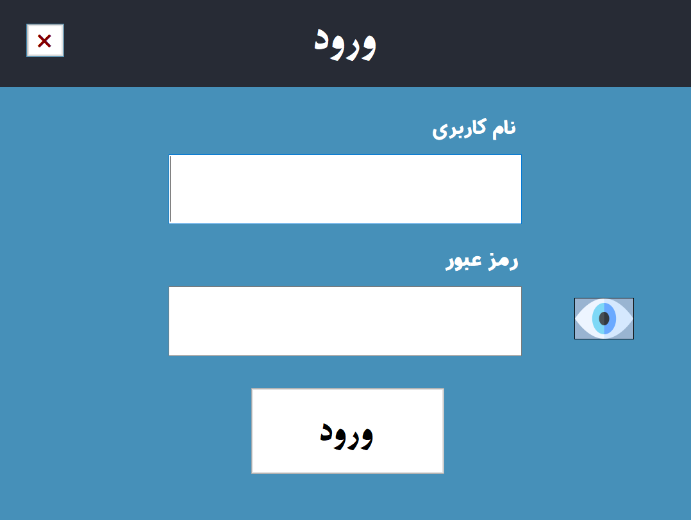
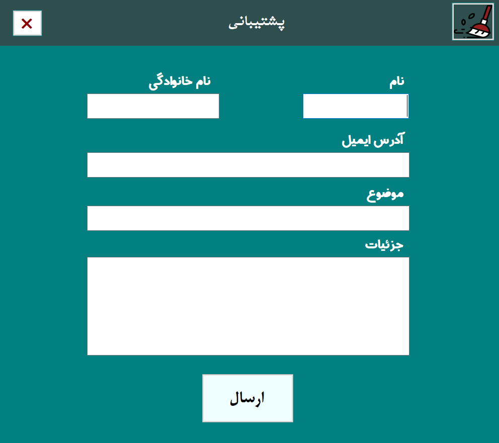

# Medical Laboratory Application

Welcome to the Medical Laboratory Application, a comprehensive solution developed in C# using Windows Forms to streamline and enhance the management of medical laboratory operations.

## Project Information

- **Completion Date**: October 2020
- **Location**: Iran
- **Language**: Persian

## Forms Overview

### 1. **frmBeforeStart**
   - An initial screen serving as a prelude before the main functionality begins.

### 2. **frmStart**
   - The entry point for users to authenticate themselves in the medical laboratory management system. Requires a valid username and password.

### 3. **frmMain**
   - The central hub of the MedicalLab application, offering access to various functionalities within the system.

### 4. **frmPatientInformation**
   - Tailored for managing patient information effectively.

### 5. **frmPatientInformationReport**
   - Displays and allows searching of patient information within the MedicalLab application.

### 6. **frmPatientReception**
   - Manages patient reception information efficiently.

### 7. **frmReceptioners**
   - Focuses on the effective management of receptionist information.

### 8. **frmDoctorsInformation**
   - Facilitates the management of doctor information, allowing users to seamlessly add, edit, and delete records.

### 9. **frmSamplingPhysician**
   - Enables users to manage information about sampling physicians, offering functions for addition, editing, deletion, and search.

### 10. **frmExperiments**
   - Dedicated to the efficient management of medical experiments, including functionalities for addition, editing, and deletion.

### 11. **frmFinancialReport**
   - Generates and displays financial reports derived from patient receptions and experiment information.

### 12. **frmInsurances**
   - Handles insurance information with options to add, edit, and delete insurance records.

### 13. **frmCenterSpecifications**
   - Manage center specifications with the flexibility to modify code, name, contact numbers, address, and other details.

### 14. **frmSetting**
   - Allows users to personalize their experience by configuring the theme (light or dark) for the medical laboratory management system. The selected theme persists after restarting the application.

### 15. **frmSupport**
   - Provides a platform for users to submit support requests and feedback to enhance the medical laboratory management system.

## Database Connection

The MedicalLab Management System relies on a robust Microsoft Access database connection, ensuring reliable storage and retrieval of essential information.

## How to Use

Follow these instructions for effective navigation and utilization of the MedicalLab application:

### 1. Install Persian Fonts
   - Fonts are available in the "Fonts" folder.

### 2. Run the Application
   - Execute the application from the following path: `MedicalLab\bin\Debug\MedicalLab.exe`

### 3. Login
   - Enter the test credentials:
     - **Username:** admin
     - **Password:** admin
   - Click the login button to access the main functionality.

### 4. Navigation
   - Explore different forms to access specific functionalities within the MedicalLab application.

### 5. Data Management
   - Utilize the forms to add, edit, and delete relevant information based on the intended functionality.

### 6. Theme Configuration
   - Access the "Settings" form to configure the theme preference between light and dark themes.

## Screenshots

## Prerequisites

Ensure that the .NET Framework is installed on your system for seamless operation.
